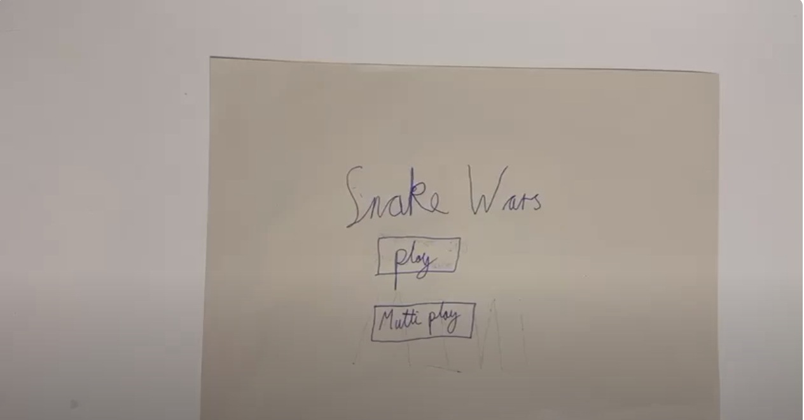
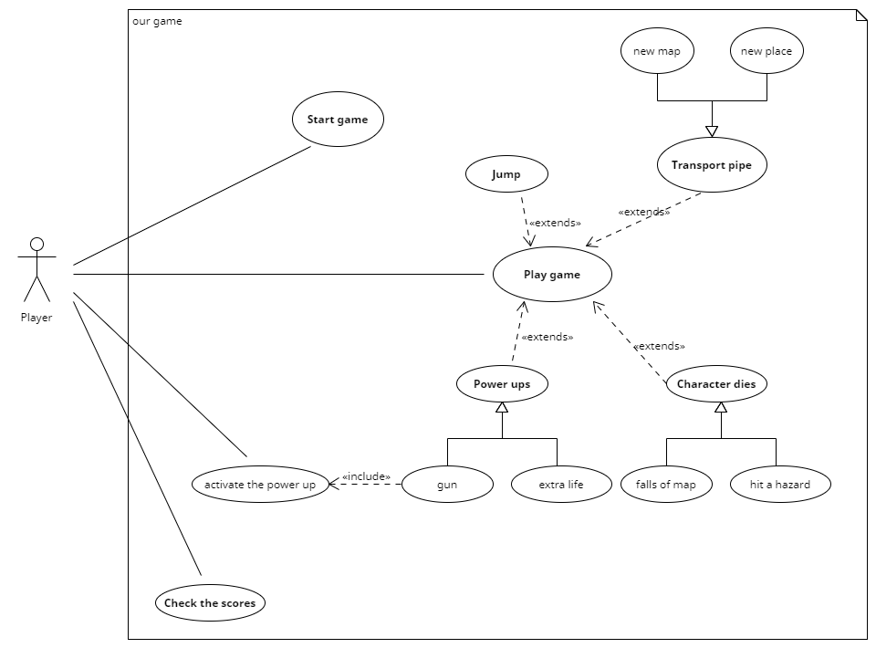

# 2024-group-6
https://processing.org/tutorials
## Table of Contents  
- [Team Photo](#team-photo)
- [Group Members](#group-members)
- [Game Ideas](#game-ideas)
- [Game Features](#game-features)
- [Snake](#snake)
- [Flappy Bird](#flappy-bird)
- [Game Selection](#game-selection---why-we-have-chosen-super-spaceman)

## Team Photo

## Group Members
<table>
    <thead>
        <th>Name</th>
        <th>Email</th>
        <th>Git Hub Username</th>
    </thead>
    <tr>
        <td>James Love</td>
        <td>James.Love.2023@bristol.ac.uk</td>
        <td>@JamesLove1</td>
    </tr>
    <tr>
        <td>Cicely Marks</td>
        <td>yb19634@bristol.ac.uk</td>
        <td>@c1c3ly</td>
    </tr>
    <tr>
        <td>Max Cai</td>
        <td>rl23261@bristol.ac.uk</td>
        <td>@sparklefoa1</td>
    </tr>
    <tr>
        <td>Bohan Zhang</td>
        <td>xr23370@bristol.ac.uk</td>
        <td>@bohanzhang</td>
    </tr>
    <tr>
        <td>Qiyue Cao</td>
        <td>oz23134@bristol.ac.uk</td>
        <td>@QQiyyue</td>
    </tr>
</table>

## Game Ideas
Key:
1-9 : Top Options
M: Maybe
N: Removed From List

| Name | URL | Sutibility / Intrest / Ranking|
| -------- | -------- | -------- |
 Snake| https://en.wikipedia.org/wiki/Snake_(video_game_genre)   | 1|
| Flappy Bird| https://en.wikipedia.org/wiki/Flappy_Bird  | 2a|
| Tetris| https://en.wikipedia.org/wiki/Tetris  | 2b |
| Angry Birds| https://en.wikipedia.org/wiki/Angry_Birds_(video_game)  | 3 |
| Kingdom Rush| https://en.wikipedia.org/wiki/Kingdom_Rush  | M |
| Super Mario| https://en.wikipedia.org/wiki/Super_Mario_Bros.  | M |
| Brick Breaker| https://en.wikipedia.org/wiki/Brick_Breaker   | M |
| Bejeweled| https://en.wikipedia.org/wiki/Bejeweled  | N |
| Zuma| https://en.wikipedia.org/wiki/Zuma_(video_game)  | N |
| Deemo| https://en.wikipedia.org/wiki/Deemo  | N |

## Game Features 

<table>
    <thead>
        <th>Game</th>
        <th>Feature 1</th>
        <th>Feature 2</th>
        <th>Feature 3</th>
    </thead>
    <tbody>
        <tr>
            <td>Snake</td>
            <td>2 Player</td>
            <td>walls</td>
            <td>crash into smaller snakes</td>        
        </tr>
        <tr>
            <td>brick braker</td>
            <td>time limit have to break enough bricks to get a particular score</td>
            <td></td>
            <td> </td>
        </tr>
        <tr>
            <td>Flappy Birds</td>
            <td>can go up pipes - leads to new places on the map or a new map entirely</td>
            <td>birds attachement or powers e.g go through a circle and get super power for instance ability to knock thing over </td>
            <td>portals back to start</td>
        </tr>
        <tr>
            <td>Kingdom Rush</td>
            <td>natural disasters(earth quake)</td>
            <td>new attackers/new towers </td>
            <td></td>
        </tr>
        <tr>
            <td>Super Mario Bros</td>
            <td> give mario a plumming truck(with a battering ram)</td>
            <td>seasons of the year () partial sight of the screen </td>
            <td></td>
        </tr>
        <tr>
            <td>Tetris</td>
            <td>new blocks </td>
            <td>exploding blocks </td>
            <td>dynamic screen size </td>
            <td>Miner that deal damage to blocks </td>
        </tr>
        <tr>
            <td>Angry Birds</td>
            <td>different animals e.g. giraffs, elephants and sharks</td>
            <td>water mode (underwater sling shot + above watersling shot) </td>
            <td>change pigs to rats everytime you fail they increase in number</td>
        </tr>
    </tbody>
</table>

## Snake
For snake we have short listed this classic game for many reasons. The top reasons that we picked this game were for its multitude of options and possibilities to be extended with new exciting inovative software devlopment features. As a group, we have highlighted the opportunity to extend Snake with features such as 2 player game play, added walls and eating smaller snakes. Each one of these features will give us, as a group, plenty to work on. The Two Player feature will enable two users on the same machine to play the same game. While adding walls will make it much harder for the snake to move around and access the much needed nutrients need for game play. To offset this we will include smaller snakes to increase the ability for the snake to increase in size.

### Prototype 

*Right-click and select "Open link in new tab" to watch the video without leaving GitHub.*

Following creating a prototype for Snake, we quickly found many positives and negative associated though carrying out our development process. This included a change of name, good demonstration and not much in the way of a need to change the core elements of our design. Feedback quickly prompted us to change the name of the game to Snake Wars as the original was too similar to other games out there.  

## Flappy Bird
Choosing Flappy Bird as our inspiration brings a delightful challenge to the table. Our concept introduces several innovative features: Firstly, we can incorporate new patterns that allow players to navigate through pipes to reach new locations or maps. Secondly, we aim to enhance the bird's abilities through unique means, e.g. the ability to shoot lasers. Lastly, we propose adding new gates that redirect players to the starting point, elevating the difficulty level of the game.

### Prototype
<!-- check to see if link works at a latter date https://img.youtube.com/vi/6UDCoNbmHIw/maxresdefault.jpg -->

*Right-click and select "Open link in new tab" to watch the video without leaving GitHub.*

We have ultimately chosen to base our game idea on Flappy Bird and transform it into "Super Spaceman" (the name may be subject to change). As demonstrated in the prototype above, we have primarily introduced three new features: the inclusion of game props, such as heart items to increase lives and a prop gun to destroy debuff effects; alongside these, the addition of negative buffs (such as signs that immediately return the player to the starting point upon collision and signs that alter gravity) constitutes another new feature; the final feature allows players to access another map through special new channels or to complete the game by traversing obstacles.

## Game Selection - Why we have chosen Super Spaceman

Although both games hold exciting potential, there was definitely a clear favourite throughout the research process, and the group has collectively agreed to pursue Super Spaceman. Ultimately, Super Spaceman has a greater scope for game features and creative opportunities. For Snake, we could not think of many challenges other than implementing walls, where as, for SSM, we were able to think of multiple categories, including various different hazards and power ups. So much, that we have had to spend time narrowing down which of our ideas to use. When researching these features, we concluded that SSM will also be more complex to implement, therefore providing us a greater chance to apply our knowledge and skills. Similarly, we feel more excited about the interface for SSM, and have already thought of different game maps. Our thoughts were confirmed in Monday’s lab, where we received positive feedback for SSM, and there was a general consensus that this was a more innovative idea and would be the most popular game. 

## Stake Holders

<table>
    <thead>
        <tr>
            <th>Stake Holder</td>
            <th>Notes</td>
        </tr>
    </thead>
    <tbody>
        <tr>
            <td>Development Team</td>
            <td>N/A</td>
        </tr>
        <tr>
            <td>Viewers</td>
            <td>People watch live game play e.g. on Youtube, Twitch or over a friends shoulder</td>
        </tr>
        <tr>
            <td>Player - Coursemates</td>
            <td>A player base familiar with the project requirements and can peer review our work.</td>
        </tr>
        <tr>
            <td>Player - General Public</td>
            <td>N/A</td>
        </tr>
        <tr>
            <td>Player - Disabilities(Colour Blind) </td>
            <td>Users with colour blindness should be able to use the app</td>
        </tr>
        <tr>
            <td>Markers</td>
            <td>Looking to play the app to mark our work within 5 mins</td>
        </tr>
    </tbody>
</table>

## User-Stories
>"As a Player from General Public I want to play a game based on flappy birds with new innovative features so that it grabs my intrigue and attention." 

>"As a member of the Development Team I want to implement a first in class app/game that push me to learn new skills."

>"As a Viewer I want to watch a game to learn by watching players that are more skilled than myself so that I can improve my game play."

>"As a Coursemate playing another groups game, I want to learn off them and become inspired by their vision and implementations of their app/game."

>"As a Player with a disability such as being colour blind I find it very difficult to play some games that dont cater to this. I would like a game which caters to my needs of having different colour contrasts so that i am not impared by my lack vision."

>"As a Marker I want to quickly assess the assignment that I am marking by playing the game within 5 mins."

>"As a Player from the general public, I want to explore different maps/scenarios in the game, so that I can experience freshness and novelty."

>"As a Viewer, I want to see changes in the speed of the game process,  as this is what captures my attention."

## Usecase Specification - General Player

**Description** - Super Spaceman is a game with inspiration taken from the game Flappy Birds. Within the following user specifiction we are going to take you through a step-by-step routine of which a general player would encounter when playing the game.

**Aim** - The Aim of the game is to prevent Super Spaceman from dying. Throughout the game he encounters many hazards of which he will have to avoid dying. As the user plays the game Super Spaceman picks up speed. 

## Usecase Specification
<table>
    <tbody>
        <tr>
            <td><b>Basic Flow</b></td>
            <td></td>
        </tr>
        <tr>
            <td>1.</td>
            <td>Player uses the the right key on the mouse to make Super Spaceman move up defying gravity. </td>
        </tr>
        <tr>
            <td>2.</td>
            <td>Super Spaceman trys to advoid all hazards.</td>
        </tr>
        <tr>
            <td>3.</td>
            <td>Super Spaceman eventually hit a hazard. Scoure is then placed on the screen in terms of time.  </td>
        </tr>
    </tbody>
</table>

<b>Alternative Flow:</b>
<table>
    <tbody>
        <tr>
            <td>Steps:</td>
            <td>Pipes</td>
            <td>Power Up's (Invinsibility)</td>
            <td>Hazards (Nuclear Bombs)</td>
        </tr>
        <tr>
            <td>Desctiption:</td>
            <td>Going down pipes Transports Super Spaceman to a new map</td>
            <td>Power ups give Super Spaceman extra powers</td>
            <td>When Super Spaceman comes into contact with a Hazard he dies</td>
        </tr>
        <tr>
            <td>1.</td>
            <td>Player uses the the right key on the mouse to make Super Spaceman move up defying gravity.</td>
            <td>Player uses the the right key on the mouse to make Super Spaceman move up defy gravity.</td>
            <td>Player uses the the right key on the mouse to make Super Spaceman move up defying gravity.</td>
        </tr>
        <tr>
            <td>2.</td>
            <td>Player guides Super Spaceman into the pipes. Super Spaceman is transported to a new map or new place on the current map.</td>
            <td>Super Spaceman comes into contact with the Power Up</td>
            <td>Super Spaceman comes into contact with the Hazard</td>
        </tr>
        <tr>
            <td>3.</td>
            <td>Super Spaceman eventually hit a hazard. Scoure is then placed on the screen in terms of time.</td>
            <td>The Space bar is used to activate the power up.</td>
            <td>Super Spaceman dies the scoure is then placed on the screen in terms of time.</td>
        </tr>
        <tr>
            <td>4.</td>
            <td></td>
            <td>Super Spaceman eventually hit a hazard. Scoure is then placed on the screen in terms of time.</td>
            <td></td>
        </tr>
    </tbody>
</table>

## Usecase - Diagram 

## Refection

test 
test0
test1